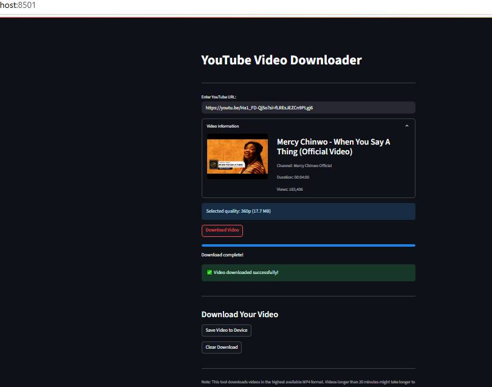

# Youtube Video Downloader

A simple, interactive YouTube video downloader built with **Python** and **Streamlit**. Just paste a YouTube link, select the format, and download!

## Features ✨
- Input any YouTube video URL
- Download in MP4 (video) or MP3 (audio)
- Displays video title, duration, and thumbnail before download
- Fast and simple interface powered by Streamlit
- Works on desktop and mobile

## How to Use 🎮
1. Input the amount you wish to convert.
2. Select the currencies you want to convert from and to.
3. Click the "Convert" button to see the results!

## Screenshots 📸
| Image 1 | Image 2 | Image 3 |
|------------------|----------------|
|  |  | 

## Tech Stack 🛠
- *Frontend*: Streamlit
- *backend*: Python 3
**Libraries**:
  - pytube for YouTube download
  - streamlit for UI
    
## Installation ⚙
1. Clone repository:
bash
git clone https://github.com/wizglobal-tech/YOUTUBE-VIDEO-DOWNLOADER
cd YOUTUBE-VIDEO-DOWNLOADER

3. Install dependencies:
bash
pip install streamlit pytube

4. Run the application:
bash
streamlit run youtube_downloader.py

## Live Demo 🌐
check it out here: [YOUTUBE-VIDEO-DOWNLOADER-App](https://youtube-video-downloader-yvd.streamlit.app/)

## Connect with Me 👋
[LinkedIn](https://www.linkedin.com/in/wisdom-douglas/) | 
[GitHub](https://github.com/wizglobal-tech)
